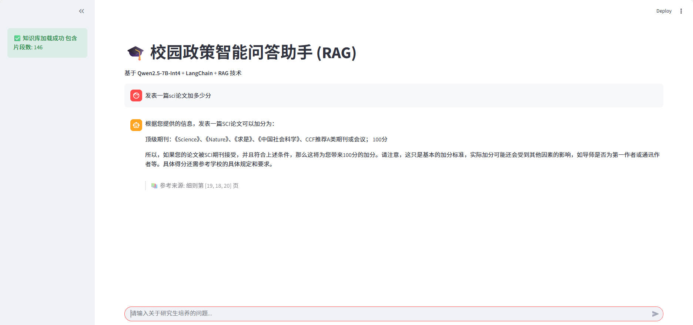

# RAG 知识库问答 Agent

团队知识分散在大量 PDF 与手册中，人工检索效率低、答案来源难以核对，直接提问大模型又易产生无依据的回答。本项目实现一个覆盖**问答编排、检索重排、增量入库与服务监控**的中文问答 Agent。

定位为**具备服务化边界的个人工程原型**：有 API 门禁、并发背压、可观测性、版本回退与容器入口，但不宣称生产落地。所有对外引用的数字都由 `evaluate.py` 真实运行产生。



## 能力

- **有界编排**：LangGraph 状态图串联意图判断 → 工具执行 → 生成 → 引用核对；无召回时改写问题重试，达到 `MAX_RETRIEVAL_ROUNDS` 仍无证据则明确拒答，步骤预算由 `MAX_AGENT_STEPS` 限制。
- **每步可追溯**：每个步骤带 `record_id` 与 `evidence`，落盘至 `runs/agent_runs.jsonl`；答案保留来源页码，可逐条核对。
- **检索重排**：BGE-M3 向量召回 + BGE Reranker 精排。
- **增量入库**：SQLite 记录文档、版本与分块状态，唯一约束避免重复入库；新版本全部写入并校验通过后才在单事务内切换为 active，失败则清理未完成写入并回退旧版本。
- **服务化**：FastAPI 提供上传、问答、健康检查、版本查询与回退；MCP Streamable HTTP 暴露四个只读工具；API Key、`X-Request-ID` 与 Prometheus 指标构成访问控制与监控边界。
- **可复现评测**：固定问题集输出检索命中率、引用准确性、Recall@K、MRR 与 Token 消耗，并与同模型、同知识库的单次检索-生成基线对比，避免用不同实验条件制造虚假提升。

## 快速开始

```bash
conda activate ai_project
python -m pip install -r requirements.txt

cp .env.example .env
# 将自己的 PDF 放入 data/（仓库不随附语料）
python create_db.py data --replace
streamlit run app.py          # http://localhost:8501
```

也可用一条龙脚本，会自动补 `.env` 与 API Key，并做离线自检：

```bash
bash scripts/run_local.sh check    # 环境、依赖与数据自检
bash scripts/run_local.sh demo     # env + data + 建库 + 离线自检
bash scripts/run_local.sh ui       # 界面
```

以 API 方式运行：

```bash
uvicorn api:app --host 127.0.0.1 --port 8080
```

接口契约见启动后的 `/docs`，指标见 `/metrics`，MCP 挂在 `/mcp/`。`.env` 中设置 `API_KEY` 后，请求需携带 `X-API-Key` 或 `Authorization: Bearer <key>`。

首次缺少本地模型时会从 ModelScope 下载。默认 Qwen2.5-1.5B 以保证本机可复现；A40 等机器可在 `.env` 改 `LLM_MODEL`，但基线与 Agent 评测必须保持同一模型。Linux 服务器部署见 [文档](#文档)。

## 核心模块

| 文件 | 职责 |
|---|---|
| `agentic_rag/agent.py` | LangGraph 状态图、可追溯步骤、恢复与完成校验 |
| `agentic_rag/knowledge_base.py` | PDF 摄取、向量召回、Reranker 精排、回退窗口 |
| `agentic_rag/document_catalog.py` | SQLite 文档版本、激活与回退 |
| `agentic_rag/tools.py` / `context.py` | 工具治理边界 / 上下文预算与压缩 |
| `agentic_rag/mcp_server.py` | 检索、问答、清单、健康四个只读 MCP 工具 |
| `agentic_rag/evaluation.py` / `baseline.py` | 指标计算 / 单次 RAG 基线 |
| `api.py` / `app.py` | FastAPI 服务入口 / Streamlit UI |
| `evaluate.py` / `run_ablation.py` | Benchmark CLI / 一键 2×2 消融矩阵 |

## 评测与测试

```bash
python run_ablation.py --repeats 3 --dataset eval/dataset.example.jsonl
python -m compileall -q . && python -m pytest -q
```

结果写入 `reports/*.json` 与 `reports/*.md`，含实验元数据（模型、embedding、reranker、设备、数据 SHA256、重复次数、计费单价），避免脱离实验条件引用百分比。指标定义见 [评测说明](eval/README.md)，CI 配置见 `.github/workflows/tests.yml`。

## 文档

- [架构与安全说明](docs/architecture.md)
- [服务化部署说明](docs/deployment.md)
- [服务器部署手册](docs/server-deploy-runbook.md) / [A40 Conda 环境配置](docs/conda-a40-setup.md)
- [评测说明](eval/README.md)

## 项目边界

单知识库原型，未实现用户级身份、多租户、持久化任务队列与分布式向量库。LangGraph 状态只在单次请求内存在，多轮历史由调用方显式传入；单一 API Key 不等于用户级身份或文档 ACL。回退窗口由 `KEEP_HISTORY_VERSIONS` 决定，超出窗口的版本向量会被回收并标记 `pruned`，不再可回退。PDF 扫描件未接 OCR，复杂表格与跨页排版可能降低切分质量。引用校验只验证「编号合法」，不等价于自然语言蕴含。Python 线程超时无法强制终止底层 CUDA 算子，生产环境应使用独立 Worker 进程。SQLite + Chroma 适合单服务实例，Docker 默认单 worker，不构成水平扩展或高可用架构。
